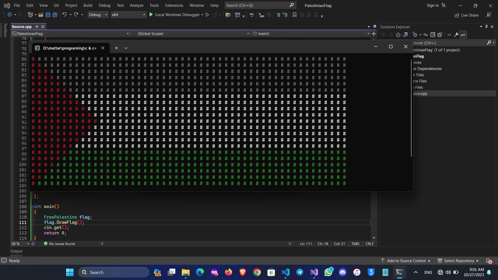
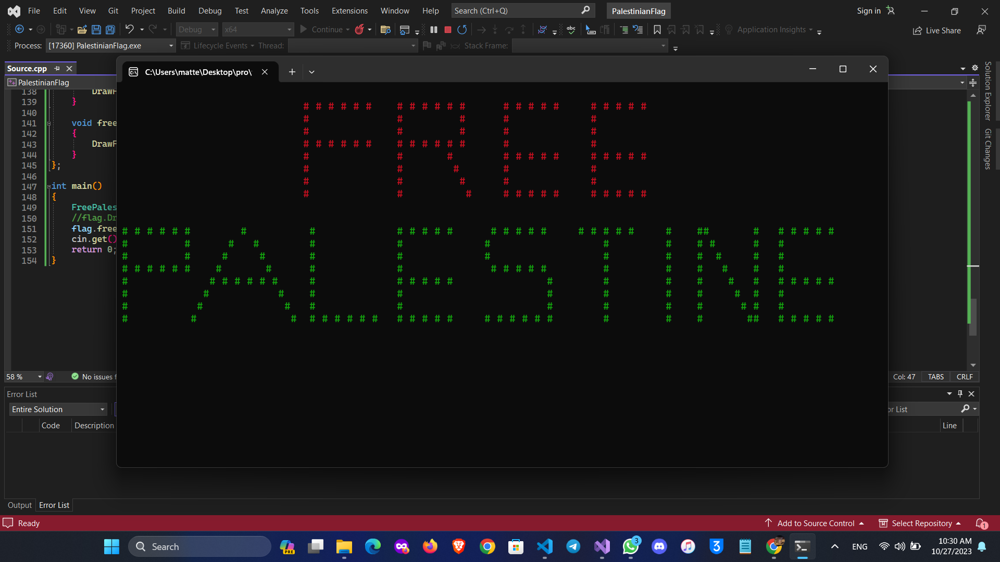

# FreePalestine Project

## Overview
The "FreePalestine" project aims to display the Palestinian flag and a message of support through a C++ console application. The project offers two versions, each drawing the flag in a console window - 'FreePalestine.cpp' specifically for Windows and 'FreePalestine_CrossPlatform.cpp' intended to function across multiple platforms such as Windows, macOS, and Linux.

## Contents
The project folder 'FreePalestine' contains the following files:

- **FreePalestine_CrossPlatform.cpp**: This file is designed to work on various operating systems using conditional compilation and ANSI escape codes for console color display.

- **FreePalestine.cpp**: This file specifically utilizes Windows-specific functionality to display the Palestinian flag in the console.

- **FreePalestine.png**: An image file showing the 'FREE PALESTINE' Sentence.

- **PalestineFlag.png**: Another image file depicting the Palestinian flag.

## Usage
The 'FreePalestine' project, when compiled and executed, generates the Palestinian flag in the console window. Each of the C++ files contains a class named 'FreePalestine', which facilitates drawing the flag using different methods specific to the operating system.

## Instructions
- **FreePalestine_CrossPlatform.cpp**: This file includes cross-platform code leveraging preprocessor directives and ANSI escape codes for compatibility across various operating systems.

- **FreePalestine.cpp**: Specifically utilizes Windows API functions for console operations, therefore primarily intended for Windows-based systems.

To execute the project:
- Compile the desired C++ file using a compatible compiler for the intended operating system.
- Run the compiled executable to display the Palestinian flag and Te message of support in the console.

## Note
Please ensure that the code is compiled using an appropriate C++ compiler suitable for the respective operating system.

> **Note**: It is important to show respect and sensitivity to our feelings as Arabs regarding the Palestinian flag and the situation in the region. It is absolutely permissible to underestimate the suffering of the brotherly Palestinian people and the feelings of the Islamic and Arab nation
May God protect Palestine and grant it victory over its enemies.

## Author

- Mahmoud Mohamed
- Email: mahmoud.abdalaziz@outlook.com
- LinkedIn: [Mahmoud Mohamed Abdalaziz](https://www.linkedin.com/in/mahmoud-mohamed-abd/)
